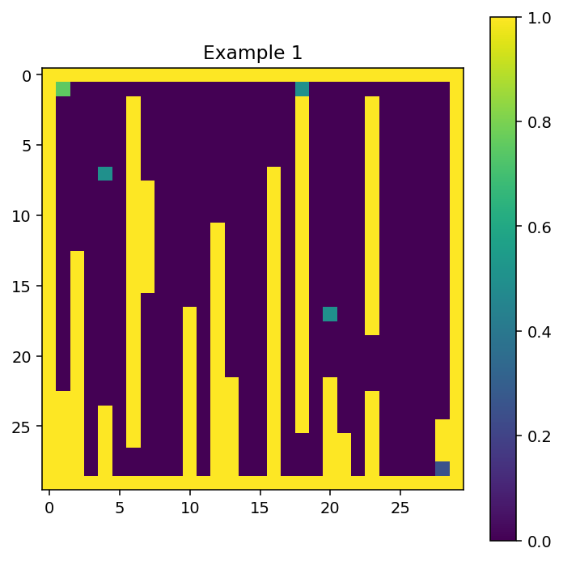
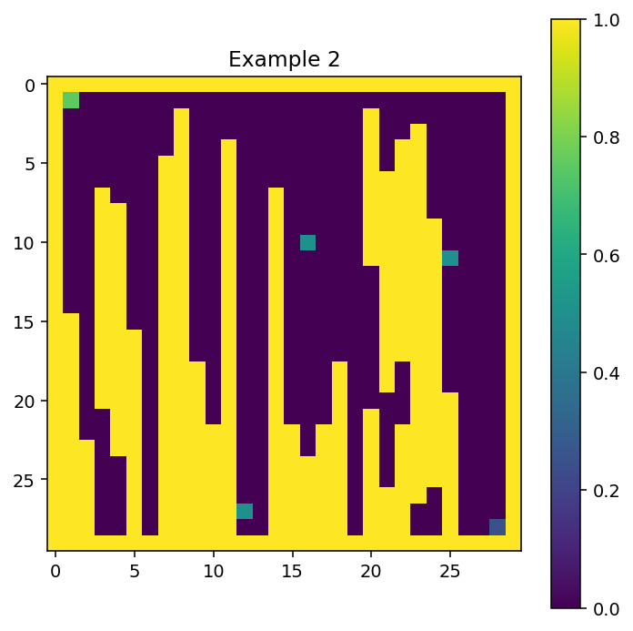
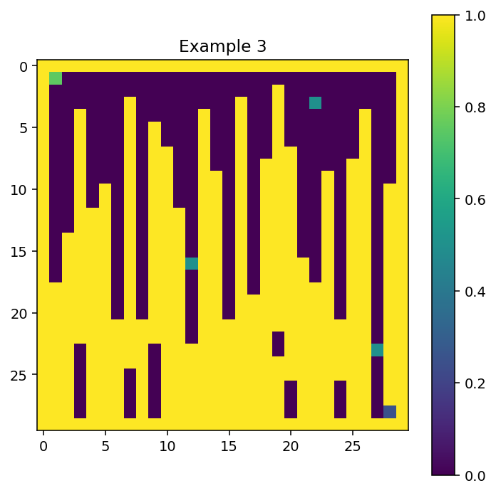

# Grid-Nexus

## Overview

Grid-Nexus is a Python project for 2D warehouse robot navigation simulation. It combines classic pathfinding and reinforcement learning so agents can navigate in changing environments with static and moving obstacles.

The project is designed to be clear and practical. It includes environment generation, sensor simulation, Q-learning, DQN, benchmarking, diagnostics, and visual analysis tools.



## Problem

Warehouse robots that rely on fixed paths fail when layouts change. A moved box, temporary aisle block, or crossing worker can break route assumptions and reduce throughput.

## Solution

Grid-Nexus trains and evaluates navigation policies in simulation before deployment. It measures not just success, but also efficiency, health, and failure behavior.

## What Was Built

- Grid-based environment generator with difficulty presets and dynamic obstacles
- Sensor module with 8 ray readings plus goal angle and distance
- Pathfinding baselines: BFS, Dijkstra, and A*
- Q-learning and DQN agents
- Logging, plotting, diagnostics, failure analysis, and policy comparison
- Benchmarking and environment difficulty analysis

## Languages And Libraries Used

The project is built in **Python**.

Core libraries:
- **NumPy** for numeric arrays and feature handling
- **PyTorch** for the DQN model and training updates
- **Matplotlib** for plotting, heatmaps, and comparison visuals

## Repository Structure

```text
grid-nexus/
├── main.py
├── environment.py
├── sensors.py
├── pathfinder.py
├── q_agent.py
├── dqn_agent.py
├── benchmark.py
├── diagnostics.py
├── scorer.py
├── analyzer.py
├── failure_logger.py
├── comparator.py
├── logger.py
├── visualizer.py
├── generate_examples.py
├── config.json
├── requirements.txt
├── examples/
├── logs/
├── models/
└── reports/
```



## How It Works

1. Generate a valid warehouse map with selected difficulty.
2. Read sensor observations from rays and goal features.
3. Train or evaluate a navigation policy.
4. Log episode metrics to CSV.
5. Analyze results with plots, diagnostics, benchmark summaries, and failure reports.

## Diagnostics And Scoring

Training logs include reward, steps, success, epsilon, health, failure type, and navigation score. The project also computes an environment difficulty index and benchmark summaries grouped by difficulty quartiles.



## How To Run

```bash
python -m venv .venv
source .venv/bin/activate
pip install -r requirements.txt

python main.py --mode train-q --difficulty medium --episodes 500 --seed 42
python main.py --mode train-dqn --difficulty medium --episodes 500 --seed 42
python main.py --mode test --difficulty medium --seed 42
python main.py --mode astar --difficulty medium --seed 42
python main.py --mode benchmark --difficulty medium --seed 42
python main.py --mode replay
python main.py --mode diagnostics
python main.py --mode score --difficulty medium --seed 42
python main.py --mode analyze-env --difficulty hard --seed 7
python main.py --mode failures
python main.py --mode compare --seed 42
python generate_examples.py
```

## Configuration

`config.json` controls environment settings, training limits, learning hyperparameters, diagnostics thresholds, scoring weights, benchmark behavior, and output paths.

## Lessons From This Project

Reliable simulation quality matters as much as model architecture. Better map realism and disturbance modeling lead to more useful policy behavior.

Metrics beyond reward are necessary for debugging. Health tracking, failure labels, and navigation score trends reveal issues that success rate alone cannot.

Classical planners are important baselines. They provide a grounded reference when evaluating learned policies.
