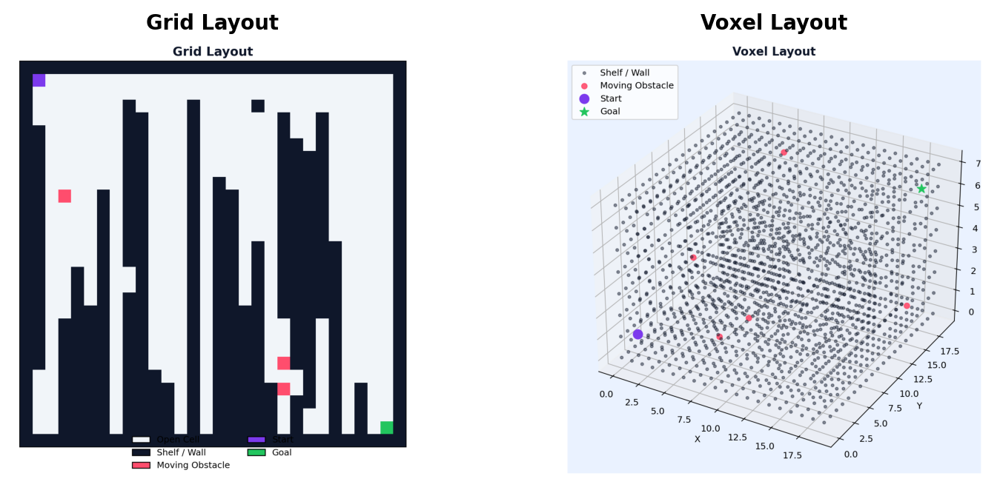
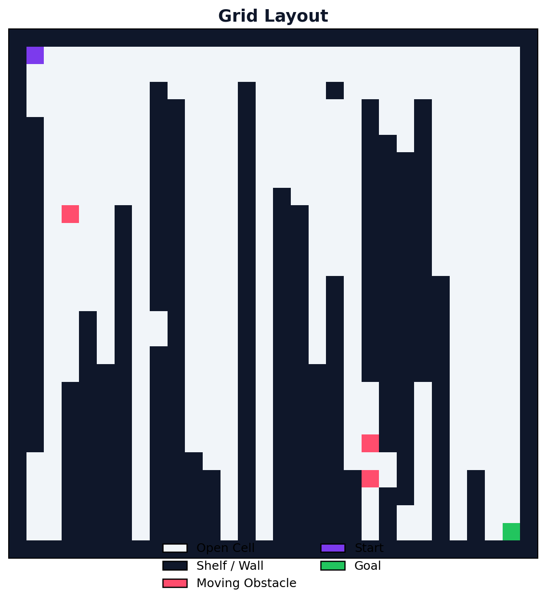
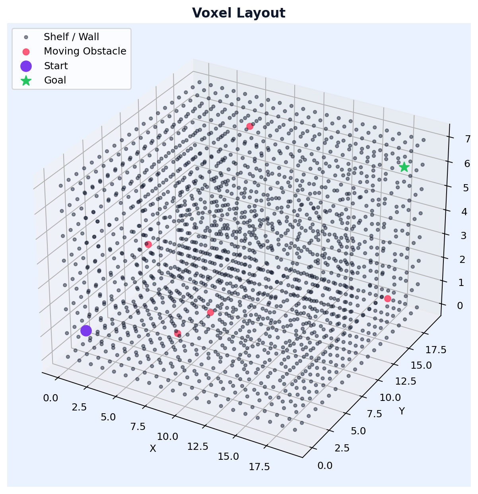

# Navra

## Foundation

Navra is a warehouse navigation intelligence simulator built for both 2D grid navigation and 3D voxel navigation. It combines classical planning and reinforcement learning so teams can test route quality, reliability, and failure behavior under realistic warehouse constraints.

Navigation is often the biggest failure point in warehouse automation. When paths break due to floor changes, operations lose throughput and teams are forced into manual intervention. Navra addresses this with a simulation-first workflow so teams can validate behavior before live deployment.

The project is implemented in **Python** and uses **NumPy** for numerical processing, **PyTorch** for deep Q-network training, and **Matplotlib** for 2D and 3D visualizations.

<p align="center">
  
</p>

## Core Capabilities

- 2D environment generation with moving obstacles and difficulty control
- 3D voxel environment generation with connectivity validation
- 2D and 3D sensor simulation modules
- Baseline pathfinding in both dimensions (BFS, Dijkstra, A*)
- Q-learning and DQN training support
- Logging, diagnostics, scoring, failure analysis, and benchmark tools

<p align="center">
  
</p>

<p align="center">
  
</p>

## Repository Structure

```text
navra/
├── main.py
├── environment.py
├── environment3d.py
├── sensors.py
├── sensors3d.py
├── pathfinder.py
├── pathfinder3d.py
├── q_agent.py
├── dqn_agent.py
├── benchmark.py
├── diagnostics.py
├── scorer.py
├── analyzer.py
├── failure_logger.py
├── comparator.py
├── logger.py
├── visualizer.py
├── generate_examples.py
├── generate_examples_3d.py
├── config.json
├── examples/
└── README.md
```

## Pipeline

1. Generate a valid 2D or 3D warehouse layout.
2. Simulate observations from the relevant sensor module.
3. Run pathfinding and/or learning agents.
4. Log reward, stability, health, and failure metrics.
5. Analyze outputs with plots, leaderboards, and diagnostics reports.

## Configuration

The `config.json` file includes settings for both environment types, training hyperparameters, diagnostics thresholds, navigation scoring weights, and output paths.

For 3D, `environment_3d` controls voxel size, difficulty, and moving obstacle count.

## Lessons From This Project

Supporting both 2D and 3D in one codebase increases complexity, but it also creates a stronger architecture for fast iteration and realistic validation.

Reliable metrics beyond reward are essential. Diagnostics, difficulty scoring, and failure classification provide the visibility needed to improve policy quality in real warehouse conditions.
